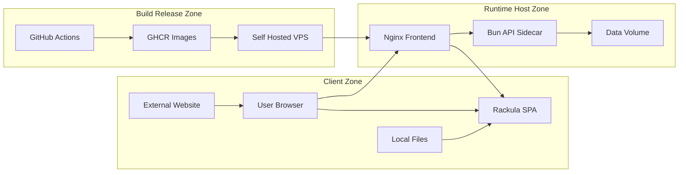

## Executive summary
Rackula’s highest practical risks are unauthorized data mutation and service disruption in persistence-enabled deployments, especially where the dev environment is internet-exposed and API auth is intentionally absent. The API has strong input/path validation and size limits, but it currently relies on network placement and reverse-proxy controls for security boundaries; without those controls, integrity and availability risks dominate over confidentiality (which is low-sensitivity by context).

## Scope and assumptions
- In scope paths:
  `src/` (SPA runtime), `api/src/` (persistence API), `deploy/` + `docker-compose.yml` + `deploy/docker-compose.persist.yml` (runtime deployment), `.github/workflows/` (build/release supply chain).
- Out of scope:
  `e2e/`, `src/tests/`, `docs/research/`, local dev convenience scripts unless they directly affect runtime or release integrity.
- User-validated context (February 6, 2026):
  Internal self-hosted usage, dev deployment may be internet exposed, no auth, low data sensitivity.
- Assumptions used for ranking:
  Reverse-proxy/TLS setup varies by operator, API may be reachable by unauthorized parties in some environments, and multi-user controls are intentionally absent.
- Open questions that could materially change ranking:
  Whether internet-exposed dev has IP allowlisting/WAF, whether backups are immutable/versioned, and whether any proxy-level auth will be added.
- Quality check status:
  All discovered entry points are covered, each trust boundary is represented in at least one threat, runtime and CI/dev are separated, user clarifications are integrated, and assumptions/open questions are explicit.

## System model
### Primary components
- Browser SPA (Svelte/TypeScript) handling layout editing, share-link decode, archive import/export, and autosave.
  Evidence: `src/App.svelte` (`onMount`, `handleLoad`, autosave effects), `src/lib/utils/share.ts`, `src/lib/utils/archive.ts`.
- Nginx frontend container serving static assets and proxying `/api/*` to sidecar API.
  Evidence: `deploy/nginx.conf.template` (`location /api/`, `/api/health`), `deploy/Dockerfile`.
- Bun/Hono persistence API sidecar exposing layout and asset CRUD and writing to `/data`.
  Evidence: `api/src/index.ts`, `api/src/routes/layouts.ts`, `api/src/routes/assets.ts`, `api/src/storage/filesystem.ts`, `api/src/storage/assets.ts`.
- Shared persistent volume storing YAML and uploaded images.
  Evidence: `api/src/storage/filesystem.ts`, `api/src/storage/assets.ts`, `docker-compose.yml`, `deploy/docker-compose.persist.yml`.
- CI/CD and image delivery pipeline (GitHub Actions -> GHCR -> VPS deploy).
  Evidence: `.github/workflows/deploy-dev.yml`, `.github/workflows/deploy-prod.yml`, `.github/workflows/release.yml`.

### Data flows and trust boundaries
- TB-1: User Browser -> SPA (`GET /`, JS bundles, URL query string `?l=...`).
  Data: share payload, user edits, local autosave state.
  Channel: HTTPS/HTTP.
  Security guarantees: CSP/HSTS/XFO/XCTO headers when deployed with provided nginx config.
  Validation: share payload decoded then validated via `MinimalLayoutSchema`.
  Rate limiting: none.
  Evidence: `src/App.svelte` (`getShareParam`, `decodeLayout`), `src/lib/utils/share.ts`, `deploy/security-headers.conf`.
- TB-2: User Local Files -> SPA import parsers (`.zip`, `.yaml`, `.json`).
  Data: archives, NetBox YAML, device-library JSON.
  Channel: browser file picker / local file APIs.
  Security guarantees: type constraints and schema validation in code.
  Validation: archive parsing + layout schema validation, NetBox required-field checks, JSON device validation.
  Rate limiting: no explicit uncompressed-size/entry-count limits.
  Evidence: `src/lib/utils/file.ts`, `src/lib/utils/archive.ts`, `src/lib/utils/yaml.ts`, `src/lib/utils/netbox-import.ts`, `src/lib/utils/import.ts`.
- TB-3: Browser -> API via nginx `/api/*`.
  Data: layout YAML, image blobs, metadata, delete/list operations.
  Channel: HTTP proxied inside container network.
  Security guarantees: body limits, UUID/slug/face validation, content-type checks.
  Validation: Zod schemas and path sanitization.
  Rate limiting: none by default.
  Evidence: `deploy/nginx.conf.template`, `api/src/index.ts`, `api/src/routes/layouts.ts`, `api/src/routes/assets.ts`.
- TB-4: API -> Filesystem volume `/data`.
  Data: YAML files, assets, folder names with UUID suffix.
  Channel: local filesystem calls.
  Security guarantees: UUID checks, slug/path sanitization, atomic write for assets.
  Validation: `isUuid`, `sanitizeForPath`, regex constraints.
  Rate limiting: none; bounded only by storage capacity.
  Evidence: `api/src/storage/filesystem.ts`, `api/src/storage/assets.ts`, `api/src/schemas/layout.ts`.
- TB-5: External websites -> Browser-initiated cross-origin requests to API.
  Data: unauthenticated API calls from arbitrary origins where reachable.
  Channel: browser fetch/CORS.
  Security guarantees: optional `CORS_ORIGIN`; default wildcard.
  Validation: route-level param/body checks.
  Rate limiting: none.
  Evidence: `api/src/index.ts` (`origin: process.env.CORS_ORIGIN || "*"`, production warning log).
- TB-6: CI/CD -> GHCR -> Self-hosted runtime.
  Data: container images and release artifacts.
  Channel: GitHub Actions, registry pull, docker compose deploy.
  Security guarantees: action SHA pinning, CodeQL workflow present.
  Validation: changelog validation for tagged release, but no runtime image signature verification in deploy workflow.
  Evidence: `.github/workflows/deploy-prod.yml`, `.github/workflows/deploy-dev.yml`, `.github/workflows/codeql.yml`, `.github/workflows/release.yml`.

#### Diagram

## Assets and security objectives
| Asset | Why it matters | Security objective (C/I/A) |
|---|---|---|
| Layout YAML and metadata (`name`, device placement, notes/custom fields) | Integrity loss breaks planning docs; exposure can reveal internal infrastructure naming/details | I > A > C |
| Uploaded device images | Tampering can mislead operators; large volume can consume storage | I, A |
| Persistence API availability | Save/load outages directly break core self-hosted persistence workflow | A, I |
| Data volume capacity (`/data`) | Exhaustion causes write failures and possible broader host instability | A |
| Container images and deployment workflow | Compromise can ship malicious runtime behavior to dev/prod | I, A |
| Local browser autosave/share payload state | Corruption can cause user data loss or client-side denial of use | I, A |

## Attacker model
### Capabilities
- Remote internet attacker can reach internet-exposed dev endpoints and call unauthenticated API routes directly.
- Internal network attacker (or compromised host) can reach self-hosted services and mutate shared layouts.
- Malicious web page can trigger cross-origin API requests from a victim browser when API is reachable and CORS is permissive.
- Social engineering attacker can send crafted share links or archives to trigger client-side parsing/decompression pressure.
- Supply-chain attacker with CI/workflow/release foothold can influence shipped images.

### Non-capabilities
- No assumption of attacker access to host root/shell by default.
- No assumption of high-value regulated data in layouts (user confirmed low sensitivity), reducing confidentiality impact tiers.
- No direct server-side code execution through YAML object tags in current parser mode (`JSON_SCHEMA` used server-side).
- No assumption that browser storage attacks cross user/browser boundaries; localStorage/sessionStorage scope remains same-origin.

## Entry points and attack surfaces
| Surface | How reached | Trust boundary | Notes | Evidence (repo path / symbol) |
|---|---|---|---|---|
| `GET /api/layouts` and `GET /api/layouts/:uuid` | Browser or direct HTTP client | TB-3 | Enumerates and reads saved layouts without app auth | `api/src/routes/layouts.ts` (`layouts.get`) |
| `PUT /api/layouts/:uuid` | Browser autosave/manual client | TB-3 | Writes YAML; UUID and schema checks exist but no auth/rate limit | `api/src/routes/layouts.ts` (`layouts.put`), `api/src/index.ts` |
| `DELETE /api/layouts/:uuid` | Browser/manual client | TB-3 | Deletes layout folders; no ownership model | `api/src/routes/layouts.ts` (`layouts.delete`) |
| `PUT /api/assets/:layoutId/:deviceSlug/:face` | Browser/manual client | TB-3 | 5MB limit and content-type checks; unauthenticated write | `api/src/routes/assets.ts` (`assets.put`) |
| API CORS policy | Any origin by default | TB-5 | `*` default enables cross-origin browser invocation when reachable | `api/src/index.ts` (`cors` config) |
| Share parameter `?l=` decode path | Visiting crafted URL | TB-1 | Inflates/decompresses user-controlled payload in browser | `src/App.svelte` (`decodeLayout` on mount), `src/lib/utils/share.ts` |
| Archive import (`.zip`) | Local file load | TB-2 | Parses zip and nested files; no explicit uncompressed byte/entry cap | `src/lib/utils/file.ts`, `src/lib/utils/archive.ts` |
| NetBox YAML import dialog | Local YAML file or text | TB-2 | YAML parse + field checks; could be large/complex input | `src/lib/components/ImportFromNetBoxDialog.svelte`, `src/lib/utils/netbox-import.ts` |
| Device library JSON import | Local JSON file | TB-2 | File text parsed and validated, duplicate slug handling | `src/App.svelte` (`handleDeviceImportFileChange`), `src/lib/utils/import.ts` |
| Dynamic analytics script load | Build/runtime config | TB-6 | Script src from build vars; CSP constrains allowed source in nginx deployments | `src/lib/utils/analytics.ts`, `vite.config.ts`, `deploy/security-headers.conf` |

## Top abuse paths
1. Goal: Unauthorized modification/deletion of persisted layouts.
   Steps: Discover exposed `/api` endpoint -> call `PUT/DELETE /api/layouts/:uuid` without credentials -> overwrite or remove data -> users load tampered/missing layouts.
   Impact: Integrity and availability loss for shared instance.
2. Goal: Drive-by cross-origin write abuse against internal users.
   Steps: Host malicious webpage -> victim on internal network visits page -> page issues fetch requests to reachable Rackula API (CORS wildcard) -> silent mutations/deletes occur.
   Impact: Integrity loss without attacker needing direct network foothold.
3. Goal: Exhaust API storage and degrade service.
   Steps: Script repeated valid `PUT /api/assets` uploads and layout writes -> consume `/data` volume -> writes fail and persistence becomes unreliable/unavailable.
   Impact: Availability degradation and potential host-side operational impact.
4. Goal: Force client denial-of-service via import/share parsing.
   Steps: Send oversized/crafted `.zip` or very large compressed share payload -> user opens/imports -> JSZip/pako inflate and parsing consume CPU/memory -> UI freezes/crashes.
   Impact: User-level availability and potential data-loss frustration.
5. Goal: Recon internal topology metadata from exposed dev instance.
   Steps: Query `GET /api/layouts` -> fetch layout YAML by UUID -> extract names/notes/asset references -> map environment details.
   Impact: Low-to-medium confidentiality exposure, supports follow-on attacks.
6. Goal: Malicious runtime deployment through CI/CD compromise.
   Steps: Compromise release/tag/workflow or dependency in build path -> publish/pull malicious image -> self-host deploy updates containers.
   Impact: High integrity impact on runtime if supply chain is compromised.

## Threat model table
| Threat ID | Threat source | Prerequisites | Threat action | Impact | Impacted assets | Existing controls (evidence) | Gaps | Recommended mitigations | Detection ideas | Likelihood | Impact severity | Priority |
|---|---|---|---|---|---|---|---|---|---|---|---|---|
| TM-001 | External or internal unauthenticated client | API reachable from attacker network path; no reverse-proxy auth configured | Call layout/asset CRUD endpoints to alter or delete persisted state | Shared layout tampering or loss | Layout YAML, images, API availability | UUID/path validation and schema checks (`api/src/routes/layouts.ts`, `api/src/schemas/layout.ts`); hardened containers (`docker-compose.yml`) | No app-level authZ/authN or ownership model | Add reverse-proxy auth for `/api/*` (Basic/OIDC/VPN allowlist), optionally add API token check for writes, split read/write permissions | Structured access logs by route+IP+UUID, alert on delete bursts and write spikes | High (dev internet exposed) | Medium | high |
| TM-002 | Malicious website abusing victim browser | Victim browser can reach Rackula API; default CORS wildcard or broad origin | Cross-origin scripted requests mutate/delete layouts | Integrity compromise via drive-by interaction | Layout YAML, images | CORS can be restricted via env (`api/src/index.ts`); input validation still applies | Default `origin: "*"` in production if unset; no CSRF-style origin enforcement | Set explicit `CORS_ORIGIN` for each environment, reject unexpected/missing `Origin` on state-changing requests, add proxy ACL for `/api/*` | Log Origin header and preflight failures; alert on cross-origin write patterns | Medium | Medium | medium |
| TM-003 | Remote API abuse (scripted) | API reachable and attacker can send repeated valid requests | Flood layout/image writes within allowed per-request size to fill disk and increase I/O | Persistence degradation or outage | Data volume, API availability | Body limits (`bodyLimit`, `MAX_SIZE`) and file type checks (`api/src/index.ts`, `api/src/routes/assets.ts`) | No rate limiting, no quota, no write throttling or retention policy | Add nginx `limit_req`/IP throttles for `/api/*`, enforce per-layout and global storage quotas, reject too-frequent writes, add cleanup policy | Monitor disk usage, write throughput, 4xx/5xx ratios, API latency; page when thresholds exceeded | High (if exposed), Medium (internal) | Medium | high |
| TM-004 | Social-engineering attacker with crafted file/link | User loads attacker-provided share URL or archive | Trigger heavy decompression/parsing (`pako`, `JSZip`) and large object creation in browser | Client freeze/crash and interrupted work | Browser availability, local unsaved state | Schema validation after parse (`src/lib/schemas/share.ts`, `src/lib/utils/yaml.ts`), import type filtering (`src/lib/utils/file.ts`) | No explicit max share length before inflate; no zip entry/uncompressed size/depth caps; parsing on main thread | Enforce strict encoded-length and decompressed-size limits, cap zip entries and total extracted bytes, parse in Web Worker with timeout/cancel path | Track import/decode failures and parse duration metrics; add UI warnings for oversized payloads | Medium | Medium | medium |
| TM-005 | Opportunistic recon attacker | Internet-exposed dev API and no auth | Enumerate `GET /api/layouts`, fetch YAML for IDs, collect names/notes/topology hints | Metadata disclosure enabling follow-on targeting | Layout metadata confidentiality | Path and UUID validation (`api/src/routes/layouts.ts`) | Read endpoints exposed without auth; design intentionally shared/single-user | Gate read endpoints behind proxy auth even in dev, or isolate dev instance/network; optionally disable persistence on public demos | Alert on high-rate list/get sweeps from single IP/ASN | Medium | Low to Medium | medium |
| TM-006 | Build/release supply-chain attacker | Control of workflow inputs, tags, or runner/repo context | Publish/pull compromised images via normal deploy path | Runtime compromise in self-hosted environments | Container image integrity, runtime trust | Pinned GitHub action SHAs and CodeQL workflow (`.github/workflows/deploy-prod.yml`, `.github/workflows/codeql.yml`) | No image signature verification at deploy; self-hosted runner trust boundary not explicitly hardened in repo | Sign images (cosign), verify digests at deploy, enforce protected tags/branches and required reviews, harden self-hosted runner network and credentials | Alert on unexpected tag releases/workflow dispatch; verify digest drift before rollout | Low to Medium | High | medium |

## Criticality calibration
- `critical` for this repo/context:
  Pre-auth remote code execution in API runtime, or supply-chain compromise that ships attacker code broadly without detection.
  Cross-environment compromise (dev to prod) through shared secrets/runner trust.
- `high` for this repo/context:
  Unauthorized write/delete of persisted layouts in reachable deployments (`/api/layouts`, `/api/assets`).
  Sustained API/storage exhaustion that makes persistence unusable.
  Malicious image deployment path compromise with realistic trigger.
- `medium` for this repo/context:
  Cross-origin drive-by API mutation requiring victim browser/network reachability.
  Client-side DoS via crafted share links/archives that impacts availability but not server integrity.
  Enumeration of low-sensitivity infrastructure metadata from exposed dev.
- `low` for this repo/context:
  Noisy scanning that does not bypass existing validation.
  Non-persistent local UI disruption requiring unusual user action and easy recovery.
  Analytics-related visibility issues without direct security impact.

## Focus paths for security review
| Path | Why it matters | Related Threat IDs |
|---|---|---|
| `api/src/index.ts` | Central security posture: CORS defaults, body limits, route exposure | TM-001, TM-002, TM-003, TM-005 |
| `api/src/routes/layouts.ts` | Unauthenticated list/get/put/delete flows and YAML handling | TM-001, TM-005 |
| `api/src/routes/assets.ts` | Upload/delete surface and size/type enforcement | TM-001, TM-003 |
| `api/src/storage/filesystem.ts` | Filesystem writes, migrations, path/UUID safety controls | TM-001, TM-003 |
| `api/src/storage/assets.ts` | Asset write patterns and path-building controls | TM-001, TM-003 |
| `api/src/schemas/layout.ts` | Core schema and path sanitization assumptions | TM-001, TM-005 |
| `deploy/nginx.conf.template` | API exposure, proxy behavior, and where rate limiting can be added | TM-001, TM-002, TM-003 |
| `deploy/security-headers.conf` | Browser-side hardening and CSP policy boundaries | TM-004, TM-006 |
| `deploy/docker-compose.persist.yml` | Runtime isolation/hardening and network exposure defaults | TM-001, TM-003 |
| `docker-compose.yml` | Common self-host deployment pattern and optional persistence profile | TM-001, TM-003 |
| `src/App.svelte` | Share-link load path, import handlers, autosave/server sync logic | TM-004 |
| `src/lib/utils/share.ts` | `pako` inflate/decode path for attacker-controlled URL data | TM-004 |
| `src/lib/utils/archive.ts` | ZIP parsing and extraction behavior for untrusted files | TM-004 |
| `src/lib/utils/file.ts` | Import file type gating and user file entry path | TM-004 |
| `.github/workflows/deploy-prod.yml` | Production image build/push/deploy trust chain | TM-006 |
| `.github/workflows/deploy-dev.yml` | Dev deployment exposure and pipeline hardening surface | TM-006 |
